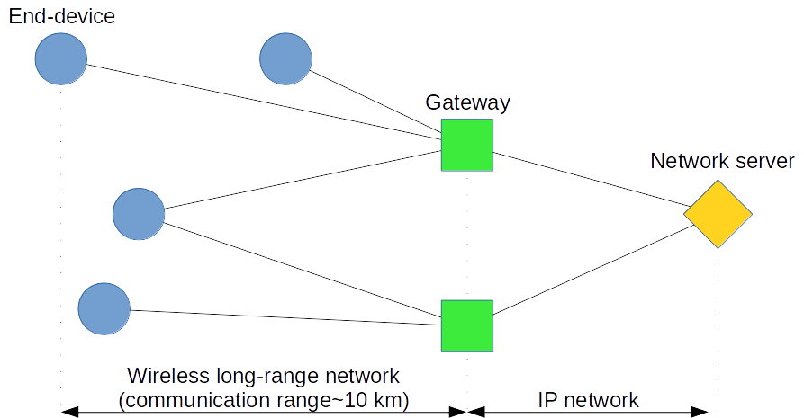

# Delegate Code Challenge 2019

Welcome to Delegate's new code challenge. This year we decided to build a code-challenge that mimics what we work with and how we work.  

The challenge for you is to build a fictious REST API for an Internet of Things application. We have created a skeleton that you can start with in C#, 
but really you can solve our challenge in any language as long as you implement the API endpoints that we have described in the [OpenAPI spec (spec.yaml)](spec.yaml). 

We love open source and git, so we have created our challenge as a git repository that you can fork. 
Once you have solved the challenge in your fork you can run the unit test to see if your implementation passes a minimum of tests (you are also welcome to add more tests). 
When you are happy with your solution you can submit a pull request to our repository, which will trigger an automated build that will build your docker image and 
run an extra set of "hidden" tests against your solution. You will see the status for how well your solution does as a status on your pull request. If you fail any of our hidden tests, feel free to update your pull request. 

For our build pipeline to be able to compile and test your solution, we ask you to supply a docker file, that when built 
will start your REST API on port 80 (without https). Since you can use Docker you are allowed to solve the challenge in any language you like.

## The Challenges 
At Delegate we do many different projects, we don't just do IoT projects, but we have chosen an IoT scenario for the challenge as it represents a lot of what we work with. 

For each of the challenges you complete and submit as part of your pull request, you get an entry into our raffle for the final code challenge price. Besides a chance to win some cool gadgets, we also evaluate all submissions based on code quality and originality, and we invite people that do a good job for a visit or maybe even a job interview. If you want to take part in either make sure that your GitHub profile has a valid email we can contact you on, or write us an email hr@delegate.dk linking your GitHub profile to an email that we can reach you on. 

If you have technical questions or suggestions to the challenges, don't hesitate to open a github issue.

### Sensor Data Decode
In this challenge you are asked to implement some decoding logic for a LoRaWAN IoT Device. 

The device is a temperature sensor, and because of the low bandwidth of LoRa devices, the sensor data is send to the REST API encoded. 
The encoding is described in the data sheet for the device. See [SensorData Sigfox LoRa Integration.pdf](docs/SensorDataIntegration.pdf) in the docs folder. 

The messages that we test your decoder with only contain data from port values 20, 40, 41, 42 and 43 so you don't have to implement all the decoding logic. Note: We do not test the output of port 20, you can ignore parsing this port data.

You should implement your decoding logic in at the REST endpoint /api/sensors/parse following the input and output schemas defined in the [OpenAPI spec](spec.yaml). 

Example input:
```JSON
{
    "fPort": "43",
    "data": "a2083714df12",
    "devEUI": "1234",
    "time": "2018-06-04T15:17:23.433+02:00"
}
```

### Network Graph 
LoRaWAN is a IoT network technology, that we work with on some of our customers. A LoRaWAN network consists of one or more gateway(s) that recieves packages from the LoRaWAN devices. 
Each Gateway is connected to a LoRaWAN server over the internet, which they forward all packages to. The LoRaWAN server then transmits the packages to an application backend. 

When a LoRaWAN devices transmits a package it doesn't know how many Gateways that will pick it up, it depends on the network topology. But at least one Gateway must pick up the package or it will be lost. 

In this challenge you will have to implement a function that given a network graph of LoRaWAN devices and gateways (represented in JSON) can determine which gateways in the network that would be a single point of failure 
(e.g. if the gateway is removed one or more devices would be out of range from any gateway).

  

In the above picture you can see what the network topology might look like for a set of devices and gateways. Now if either of the two gateways were to unexpectedly fail, at least one or more device would "go down" with it. We want to find out which of these gateways are a failure point. In the case of the image, both gateways would be failure points, since they both have devices with single connections connected to them. 

You should implement your network failure simulation at REST endpoint /api/networkplanning/simulate following the input and output schemas defined in the [OpenAPI spec](spec.yaml). 

The input JSON for the above image would look like this example input:
```JSON
{
    "graphs": [
        {
            "label": "LoRaWAN network of devices and gateways",
            "type": "network",
            "nodes": [
                {
                    "id": "dev001",
                    "type": "Device",
                    "label": "Device 1"
                },
                {
                    "id": "dev002",
                    "type": "Device",
                    "label": "Device 2"
                },
                {
                    "id": "dev003",
                    "type": "Device",
                    "label": "Device 3"
                },
                {
                    "id": "dev004",
                    "type": "Device",
                    "label": "Device 4"
                },
                {
                    "id": "gw001",
                    "type": "Gateway",
                    "label": "Gateway 1"
                },
                {
                    "id": "gw002",
                    "type": "Gateway",
                    "label": "Gateway 2"
                }
            ],
            "edges": [
                {
                    "source": "dev001",
                    "target": "gw001",
                    "relation": "is_connected_to"
                },
                {
                    "source": "dev002",
                    "target": "gw001",
                    "relation": "is_connected_to"
                },
                {
                    "source": "dev003",
                    "target": "gw001",
                    "relation": "is_connected_to"
                },
                {
                    "source": "dev003",
                    "target": "gw002",
                    "relation": "is_connected_to"
                },
                {
                    "source": "dev004",
                    "target": "gw002",
                    "relation": "is_connected_to"
                }
            ]
        }
    ]
}
```

### Reverse Geocode 
Many LoRaWAN gateways, and even some sensors have a built-in GPS that can be used to locate where the device is setup. 

Unfortunately for most people latitude/longitude coordinates doesn't mean a whole lot. So the administrators of the system wants an endpoint that can return the country from a GPS coordinate. 

How you implement this is up to you, you can use a 3rd party service or maybe a local database. We only expect country returned as an ISO 3166 2-character code.

You should implement your Geocode lookup at REST endpoint /api/sensors/geocode following the input and output schemas defined in the [OpenAPI spec](spec.yaml). 

Example input:
```JSON
{
    "long": "12.484492",
    "lat": "55.781619",
    "devEUI": "1234",
    "time": "2018-06-04T15:17:23.433+02:00"
}
```
